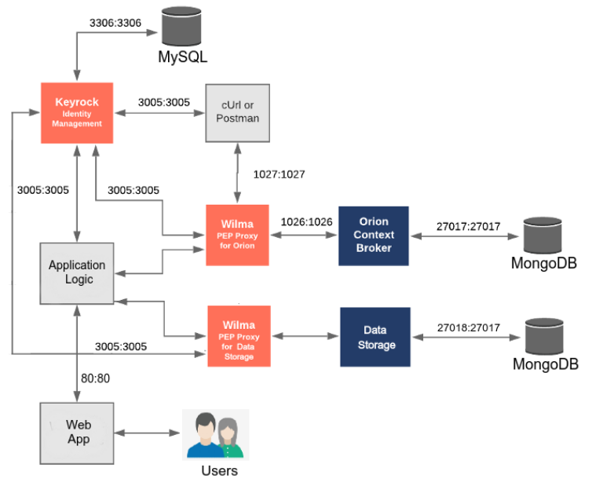
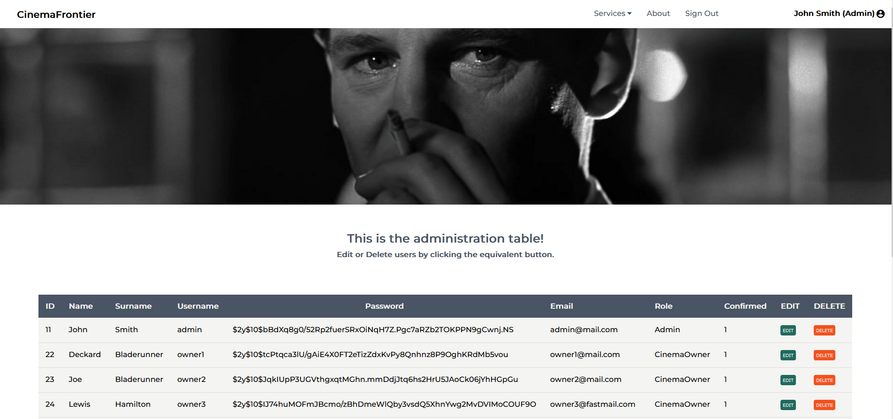
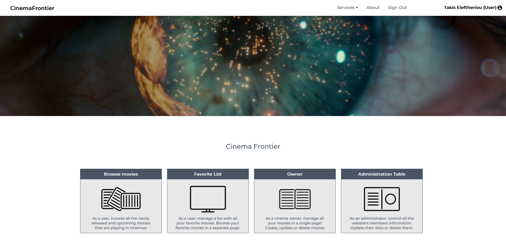
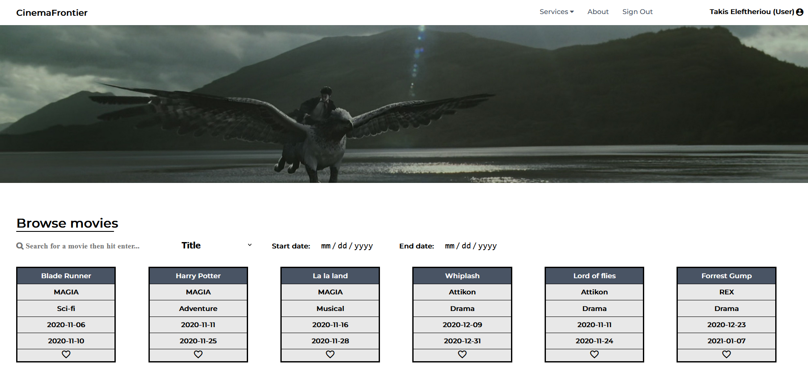
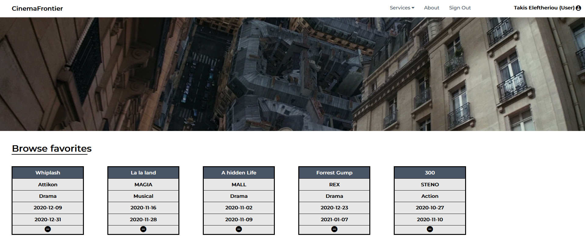
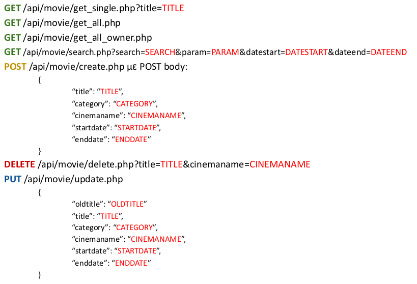
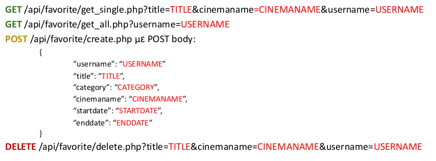
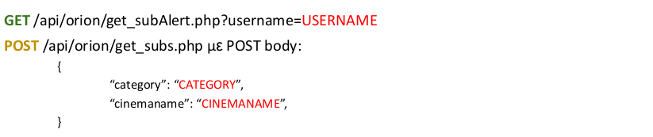

# CinemaFrontier

**CinemaFrontier** is a cloud microservices demo application. It consists of a 9-tier microservices application and is deployed in containers with **docker and docker-compose**.

# Architecture

|Service|Description|
|-------|-----------|
|Application Logic|Exposes an Apache HTTP server to serve the website. Written in **PHP**, is basically the frontend service.
|[Keyrock Identity Manager](https://fiware-idm.readthedocs.io/en/latest/)|Manages user data, adds **user authentication and authorization** via the Keyrock API.|
|[Wilma PEP Proxy](https://fiware-pep-proxy.readthedocs.io/en/latest/)|Enforces access control for security purposes, a proxy to protect the other services.|
|Data Storage|A **REST API** service written in PHP that supports _GET/POST/DELETE/PUT_ on movie and favorite data. Extends the pub/sub system, for user-specific alerts.
|[Orion Context Broker](https://fiware-orion.readthedocs.io/en/master/)|A **publish/subscribe** service that manages movie subscriptions as context elements. Enables notifications when certain conditions are met.|
|[MySQL](https://www.mysql.com/)|Used by Keyrock to store all the user related data.|
|[MongoDB](https://www.mongodb.com/)|Two instances in the architecture, one that serves backend functionalities for the DataStorage service and stores all the movie and favorite data. The other one for storing the Orion context elements data.|
|[Mongo Express](https://github.com/mongo-express/mongo-express)|(Optional for the execution of the application) A helpful tool that provides a GUI for data management of the MongoDB instances.|

This application is a web-based movie app with 3 type of users.

## 1. Admins
Administrators supervise the whole platform, have access to the administration table and can _create/update/delete_ user accounts. In addition, the can enable or disable user access.

## 2. Cinema Owners
Cinema owners manage the movies shown in the site. They can _create/update/delete_ movies that belong to their cinemas.

## 3. Users
Users can browse the movies provided by the cinema owners, and can create a dedicated favorite movie list for themselves. If they add a movie to their favorite list, they automatically subscribe to it and can receive updates in real time for that particular movie, for example if it's premiere date changes.

# DataStorage REST API Reference Manual

## Movies:

## Favorites:

## Orion

